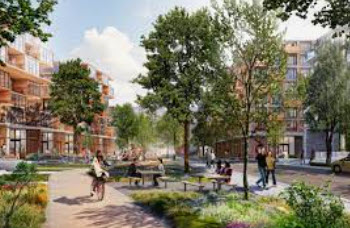
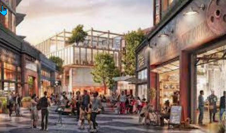

+++
title = 'Construction News'
date = 2024-05-07T12:13:31-07:00
description = "A lot of things being built up here"
weight = 30

[menus.main]
    name = 'Development'

+++

## Sobrato Builders

By 2025, we are going to have a small city​ in front of our park. SVNA has been working with the Sobrato Organization since 2017, giving feedback on the develop-ment of the project. The South Parcel, on the La Avenida side, is now under construction. Sobrato will start on the North Parcel, on the Space Park side, sometime in 2023 or 2024.

​
In our meetings with Senior VP Tim Steele, we asked if Sobrato could install a gate at the end of El Centro, so we can walk, bike, dine, and shop in the new "mixed-use" development. Mr. Steele said a gate sub-project can be added to the plan if we can get agreement from residents and park management. During our monthly meetings, many residents have spoken up in favor of the gate and opened the discussion of other potential gates, so we're going to continue to work on that.​

### Construction in Progress

​
But more important is the status of the construction. We will be working with Pear project manager Jonah Elisha going forward, and Superintendent Matt Li Marzi, but we still talk to Tim Steele occasionally about the project.

Tim told us that they have placed vibration monitors in the park to record any potential disturbances to our homes. If your home has been leveled and you have the paperwork to prove it, they will restore any leveling changes or damage done by construction. But because they are using auger technology instead of jack-hammers for excavating, they think any such disturbances will be minimized.
​
Devcon Construction is the builder, and the South Parcel development started with the new Google office building on the corner of Inigo and La Avenida first. There will eventually be a light at that corner, and CalTrans will be reconfiguring the 101 offramp to divert traffic into that area, which should ease traffic on Shoreline.
​
Sobrato has a construction office in the Pear Theatre office building, but we can phone Jonah Elisha at (808) 747-3462 to talk about any concerns about their project.

### Google and Sobrato Construction

We have been involved with Google planners and developers of North Bayshore since 2015. Google Real Estate and Workplace Services, Government Affairs and Public Policy, Lendlease, and Community Development experts have been helpful and responsive to Santiago Villa residents.
​
With Sobrato and Google's new developments, we should have a vibrant new neighborhood by 2025. We're going to continue to work with them to make sure our community remains an integrated part of the new neighborhood.

## La Avenida Apartments

Demolition has been completed on the new 100% affordable housing project at 1188 Armand Drive, and Obayashi Corp. has started construction at 1100 La Avenida.

Santiago Villa residents have been invited to the groundbreaking on March 3rd at 12:30. RSVP by February 27 if you'd like to attend. Lunch will be served after the speeches.

If you want to ask questions or contact the developer, you can find email and phone information on Eden Housing's web page on the project. If you have complaints or comments, contact our City Senior Building Inspector, John Carr, by email or phone.

### Biking Improvements

The new bike lane to Shorebird is now directly accessible from Space Park. What used to be a break in the fence between Pickering Labs and Google (1250 and 1280 Space Park Way) now opens to a split bike path.

Google has made major improvements to bike paths on its campus. View their video showing the vision for Charleston between Alta and Shoreline. Also, on Crittenden, the bike path now joins the Steven Creek Trail, and on Stierlin, the street has been reconfigured for bike traffic.

The bike path that was blocked off during construction between Huff and Alta has been restored, and it is now connected to the Permanente Creek bike path, which goes over 101.

### Parking Update

The Sobrato project's parking core is nearly completed, and apartment construction has started around it. During construction, Sobrato workers and staff will be sharing the Pear Google parking lot. Their vehicles will park only in the areas they have fenced off.

Microsoft now has a new employee parking lot behind its campus, and Google will be building a new parking lot at the current location of 1345 Shorebird, which is right outside of our park's fence.

The big Landings lot, south of Charleston between Alta and Huff, is nearly complete, and it's an attractive design. There will be a bike shop and other retailers on the ground level, behind the windows that run almost the whole length of the building.

### Santiago Villa Parking?

We've lost parking on La Avenida and Space Park Way, but that is not directly attributable to Sobrato, Google, or Microsoft.

The City's urban planners for North Bayshore redesigned our neighborhood to increase bike and pedestrian traffic and discourage auto traffic. Developers were instructed to follow their plan.

SVNA requested space in the new Google lot planned at 1345 Shorebird, but potential legal liabilities were cited in the denial. When that lot is finally built, we will try again.

## Google's Housing Project

Google is implementing the City's plan for North Bayshore with new designs from SITELAB, Google's urban designer, and Lendlease, their residential development partner. They gave us an update at our next dinner meeting on October 20, 2022. But we lost Nikki Lowy, the Community Director responsible for the project, in the Google layoff. The project is probably going to be delayed because of that.

But once it is completed, Google's projects will add thousands of residences and local retailers, and the company will donate land for a school. The objective is to decrease the number of cars and busses coming into NBS daily, and to provide a walkable, bikeable space for all NBS employees and residents.

The current plan affecting us is an extension of a new greenway, which will run in front of our park, into the expanded wildlife area at the new Eco Gem at the Charleston Retention Basin, just north of the egret rookery.

The northeast corner will be restored as a natural habitat, and an Urban Ecology Center that will serve as a destination for nature hikes. Residents and employees will be also be able to use a new bike and pedestrian pathway to get into The Wilds, which is what they plan to call their nature area.
​
Google's urban planners are also proposing a new street, Monarch, north of Santiago Villa, and employee parking would be at the end of that street (currently 1345).
​
Right now there is a fence and a tree line there, but the natural habitat will be maintained. Santiago Villa residents will probably want to have direct access to the new neighborhood, or perhaps have another gate into it at Oro Way and the northern end of Armand. There might also be an opportunity to restore a gate behind the park leading to the Stevens Creek Trail, since there used to be one at the end of Casa Grande.
​
Google Real Estate and Workplace Services (REWS) has been careful to make sure Santiago Villa residents have been involved in their plans. Some of us were involved on Charleston East, which is nearly finished, and we were present at groundbreaking. We're hoping to be invited to attend the ribbon-cutting, perhaps next year.

When construction is done, the new NBS will be a nice place to walk, bike, dine, and shop. We just have to be determined to live that long!

​
